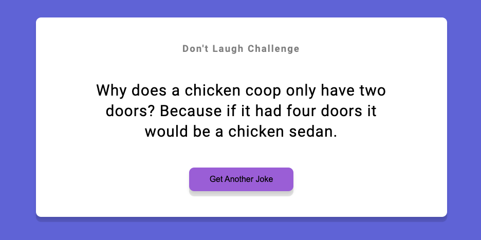

# Dad Jokes - Random Joke Generator

This project is a simple web application that generates random jokes using a third-party API when the user clicks a button. It is built using HTML, CSS, and JavaScript.

## Getting started

To get started with the project, simply download the code or clone the repository to your local machine.

`git clone https://github.com/IqbalAhmadi/dad-jokes-application.git`

## Usage

To use the application, simply open the `index.html` file in your web browser. Click the "Get Another Joke" button to generate a random joke.

## Third-party API

This project uses the icanhazdadjoke API to generate random jokes. You can find more information about the API on their website `https://icanhazdadjoke.com/`.

## Contributing

If you would like to contribute to the project, please fork the repository and submit a pull request. All contributions are welcome!

## Acknowledgments

- Thank you to the developers of the icanhazdadjoke for providing a great API for generating random jokes.
- Thank you to the open source community for providing great resources for building web applications.
